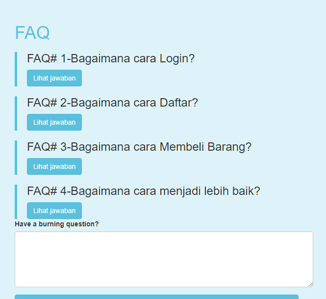

# Setup:
- buat DB "magento-faq"
- buat table "questions" (jenis 'column' akan dijelaskan oleh gambar)

# fiturnya ini:
- halaman FAQ utk client
- halaman Admin utk admin
- di Admin, admin bisa isi jawaban dan memilih utk menampilkan suatu pertanyaan atau tidak

# teknologinya:
- PHP
- MySQL

# Screenshots
## FAQ Page: Client Side
Inline-style:

## FAQ Page: Admin Side

## Database Structure

